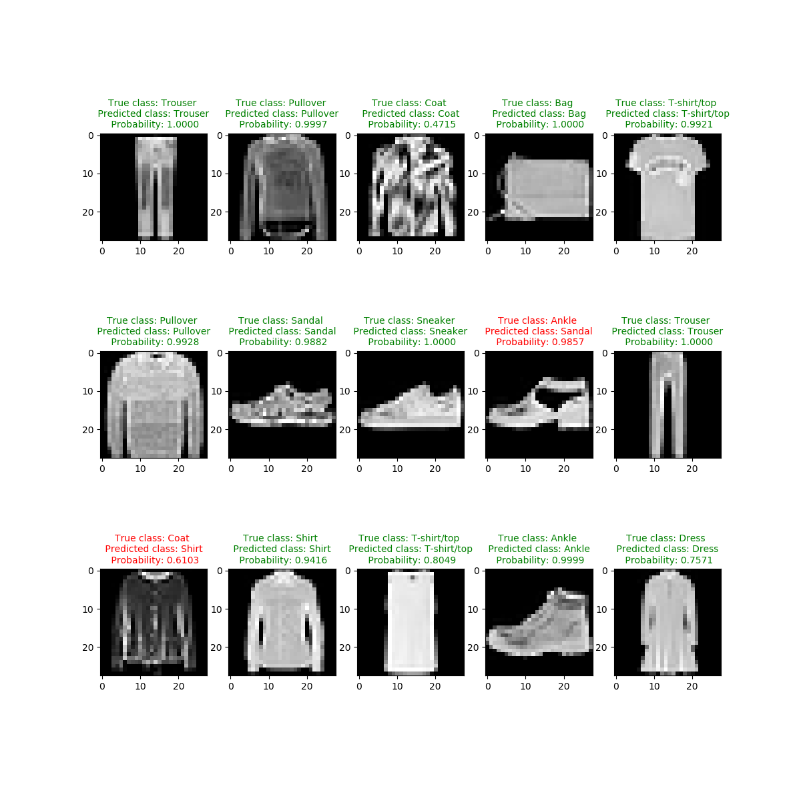

# **Fashion MNIST Deep learning**
Train a deep Convolutional neural network to classify Zalando’s article images with keras. 

## Dependencies
* tensorflow
* keras
* pandas
* numpy
* mathplotlib

## Result
Example of 15 modelpredictions generated. Green title means correct classifications and red title non-correct classifications. 

## MNIST for beginners in tensorflow:
https://www.tensorflow.org/tutorials/

## Download Fashion MNIST data:
https://www.kaggle.com/zalando-research/fashionmnist

