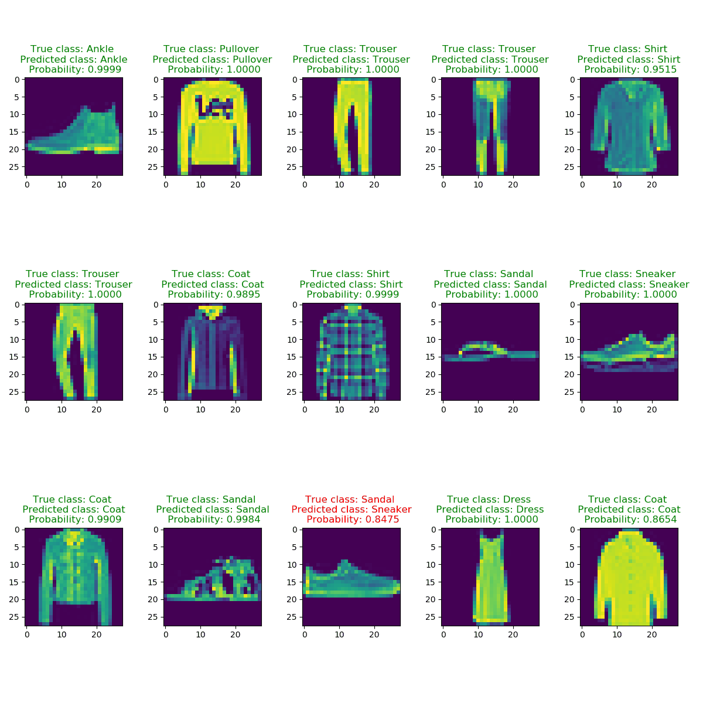

# **Fashion MNIST Deep learning**
Train a deep Convolutional neural network to classify Zalando’s article images with keras. 

## Dependencies
* tensorflow
* keras
* pandas
* numpy
* mathplotlib

## How to

The mainscript `main.py`.
1) Reads csv files with a 60000/10000 split (Train and test) to pandas dataframes. Rename class-numbers to their corresponding clothing type. Transform dataframes to numpyarrays, reshape them to 28x28 arrays and normalize the values varying between 0 to 255. 

2) Specify batch size, number of classes and epochs. Convert categorical vectors to binary class matrix enabling matrix-operations within the network. Define a sequential model and add convolutional, pooling and fully connected layers. Hyperparameters are intuitively predefined and relevant loss function and evaluation metrices are set. 

3) The model history, categorical and probability predictions are saved and visually evaluated in a defined function. 

Predictions, truth and probability. Green title is correct classification and red title shows the non-correct classifications. 

## MNIST for beginners in tensorflow:
https://www.tensorflow.org/tutorials/

## Download Fashion MNIST data:
https://www.kaggle.com/zalando-research/fashionmnist

