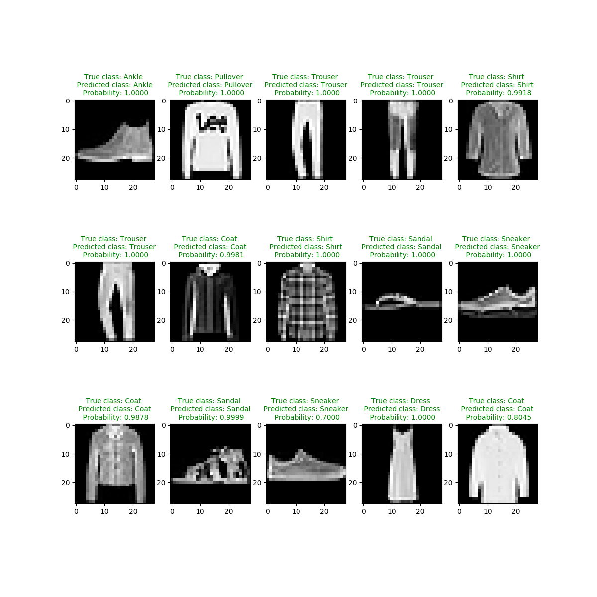

# **Fashion MNIST Deep learning**
Train a deep Convolutional neural network to classify Zalando’s article images with keras. 

## Dependencies
* tensorflow
* keras
* pandas
* numpy
* mathplotlib

Predictions, truth and probability. Green title is correct classification and red title shows the non-correct classifications. 

## MNIST for beginners in tensorflow:
https://www.tensorflow.org/tutorials/

## Download Fashion MNIST data:
https://www.kaggle.com/zalando-research/fashionmnist

